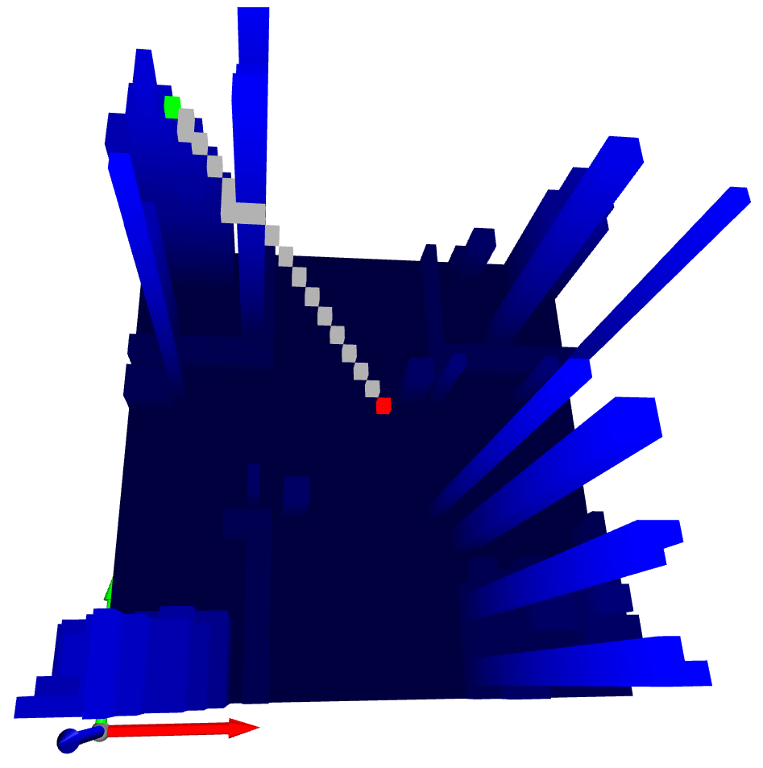

# python-pathfinding3D
Based on [python-pathfinding](https://github.com/brean/python-pathfinding) by @[brean](https://github.com/brean).

Algorithms available:

    - A*
    - Dijkstra
    - Bi-directional A*
    - Iterative Deeping A* (IDA*)

## Installation

Clone the repository and install with pip.

```sh
$ git clone https://github.com/harisankar95/python-pathfinding3D ~/path/to/repo
$ cd ~/path/to/repo
$ pip install -e .
```

## Example
Please check the example file for basic usage.
```sh
$ cd ~/path/to/repo/example
$ python view_map.py
```

